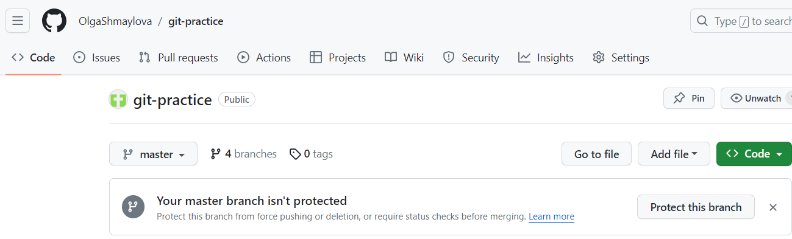
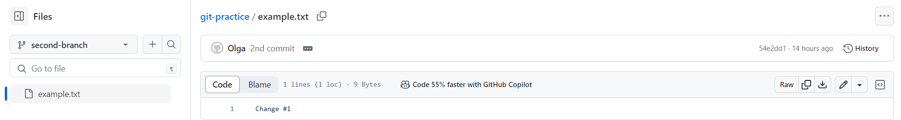
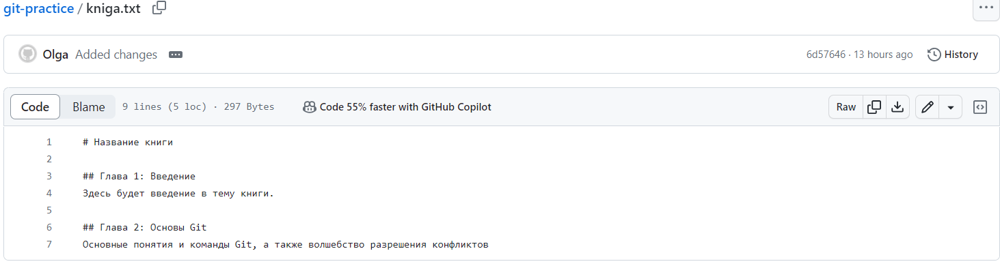
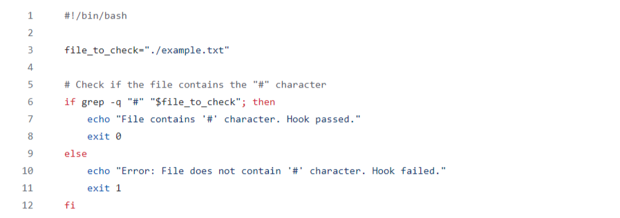
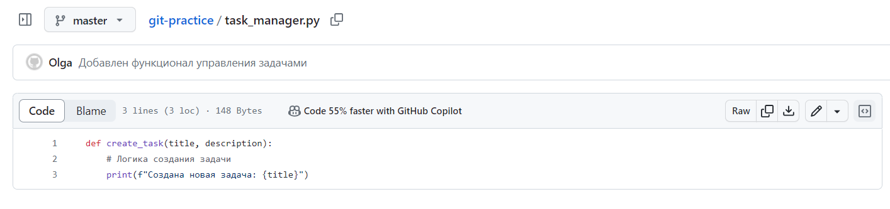
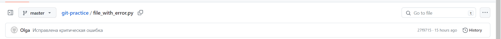

# Отчет по лабораторной работе №5
## Введение
1. Сначала я создала репозиторий _git-practice_ на _GitHub_ и скопировала его _URL_-адрес. 
    
2. Далее с помощью терминала и команд _git clone_ и _cd_ я перешла в папку для локального сохранения репозитория.
3. Потом я создала новый текстовый файл _example.txt_, добавила в него некоторый текст и запушила на _GitHub_ в основуную ветку _master_, используя команды _git add_, _git commit -m_ и _git push_.
4. Затем я создала новую ветку _second branch_ с помощью команды _git branch_, переключилась на нее с помощью _git checkout_.
5. После я отредактировала файл _example.txt_, повторила некоторые шаги из пункта 3, переключилась обратно в основную ветку _master_ помощью _git checkout main_ и слила изменения из _second branch_ в основную ветку, используя _git merge_ и _git push_.
    
## Работа с ветками
1. Я создала новый текстовый файл с базовой структурой книги _kniga.txt_.
    
2. С помощью _git checkout -b_ создала новую ветку _feature-login_.
3. Далее я внесла изменения в файл, закоммитила их и отправила ветку на _GitHub_, используя _git add_, _git commit -m_, _git push origin_.
## Работа с удаленным репозиторием
1. Я переключилась на основную ветку _master_, внесла изменения в файл _kniga.txt_, закоммитила изменения и отправила их на _GitHub_ с помощью _git add_, _git commit -m_, _git push origin_.
## Моделирование конфликта
1. Я вернулась в ветку _feature-login_, изменила главу 2 в файле _kniga.txt_, закоммитила изменения и отправила их на _GitHub_, используя _git checkout_, _git add_, _git commit -m_, _git push origin_.
## Разрешение конфликта
1. Я вернулась в основную ветку _master_ и попробовала слить изменения с помощью _git checkout master_ и _git pull origin master_. Возник конфликт.
2. Я разрешила конфликт, удалив метки и оставив нужные изменения.
3. Я закоммитила решение конфликта и отправила его на _GitHub_ с помощью _git add_, _git commit -m_, _git push_.
## Автоматизация проверки формата файлов при коммите
1. Я создала _bash-script_, который будет выполнять проверку формата .txt файлов.
    
2. Я добавила скрипт в репозиторий, поместив его в папку _.git/hooks_ и убедившись, что у него есть права на выполнение с помощью _cp_ и _chmod +x_.
3. Далее я попробовала внести изменения и закоммитить. Теперь, при каждой попытке закоммитить изменения, Git будет автоматически выполнять проверку формата файлов перед коммитом.
4. При возникновении необходимости внести изменения в файлы, чтобы они соответствовали формату, нужно внести изменения, добавить файлы и снова попробовать закоммитить.
## Использование Git Flow в проекте
1. Сначала я проверила, есть ли у меня на компьютере _Git Flow_.
2. Затем я выполнила инициализацию _Git Flow_ в корне репозитория с помощью _git flow init_.
3. Создала ветку для новой функциональности "task-management" с помощью _git flow feature start task-management_.
4. Внесла изменения в код для добавления функционала управления задачами _task_manager.py_ и выполнила коммит.
    
5. Потом я завершила фичу и объединила ее с основной веткой с помощью _git flow feature finish task-management_.
6. Далее я переключилась на ветку _develop_ и начала создание релиза:
> git checkout develop
> 
> git flow release start v1.0.0
7. Я внесла изменения, связанные с релизом:
> echo "v1.0.0" > version.txt
> 
> git add version.txt
> 
> git commit -m "Обновлена версия для релиза v1.0.0"
8. Я завершила релиз и объединила его с ветками _develop_ и _master_:
> git flow release finish v1.0.0
9. Создала _hotfix_, если в процессе использования выявлена критическая ошибка:
> git flow hotfix start hotfix-1.0.1
10. Внесла изменения для исправления ошибки и закоммитила:
> git add file_with_error.py
> 
> git commit -m "Исправлена критическая ошибка"
    

11. Завершила _hotfix_ и объедините его с ветками _develop_ и _master_:
> git flow hotfix finish hotfix-1.0.1
12. Отправила изменения на удаленный репозиторий:
> git push origin develop
> 
> git push origin main
